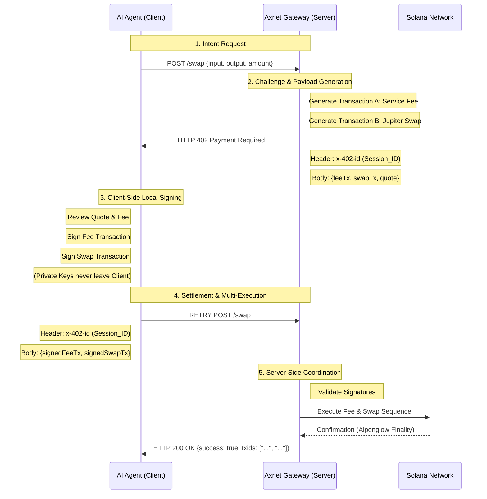

# 🛸 Axnet: The x402 Gateway for Solana Agents

**Axnet** is a stateless, keyless execution layer for Solana. It enables autonomous agents and developers to integrate **Jupiter** liquidity via the **x402 (Payment Required)** protocol - removing the need for API keys, accounts, or centralized subscriptions.

[Website](https://axnet.fun) • [Twitter](https://x.com/axnetfun) • **Status: Public Beta Live March 2026**

---

## 🏗️ Verified Identity
Axnet is a registered and verified infrastructure tool on the **ERC-8004 Agent Registry**.
* **Asset ID:** `DEpPuMUvZGHUAJtN5gVxUNFQUL8jsjF26T781gMT1twE`
* **Registry:** [8004.qnt.sh](https://8004.qnt.sh/)
* **Reputation:** Powered by **ATOM Engine** (Tier: **Bronze** - *Indexing Active*)
* **Dispute Resolver:** `solana:8oo4:ATOM-SEAL-v1`

---

## 💡 The Dual-Transaction x402 Handshake
Axnet utilizes the HTTP 402 standard to facilitate secure, non-custodial swaps. Unlike standard gateways, Axnet provides a **Two-Transaction Bundle** that separates the service fee from the liquidity swap. 

### **The Protocol Flow**
1. **Intent Request**: The Agent sends a swap request to `/swap`.
2. **Challenge Generation**: Axnet returns an **HTTP 402 Payment Required** response. The body contains two unsigned transactions: **Transaction A (Service Fee)** and **Transaction B (Jupiter Swap)**.
3. **Local Signing**: The Agent reviews the quote and signs both transactions locally using its own private key. **Private keys never leave the client environment.**
4. **Settlement**: The Agent retries the POST request with the signed transactions and the `x-402-id` session header.
5. **Coordination**: The Axnet Go-engine validates the signatures and manages the broadcast sequence to the Solana cluster, ensuring the swap and the fee are processed together.

---

## 🛠️ Technical Implementation

### **Non-Custodial Multi-Execution**
* **Payload Delivery**: Axnet returns two base64-encoded transactions (Fee + Swap).
* **Local Signing**: The agent signs both transactions using its own secure wallet provider.
* **Execution Coordination**: The Axnet Go-engine manages the broadcast sequence to the Solana cluster, ensuring the swap and the fee are processed in the same logical block.

### **MCP Integration**
Axnet is **MCP-Ready**. Agents using Claude Desktop, Cursor, or ElizaOS can connect directly to our discovery server:
* **Endpoint:** `https://mcp.axnet.fun/sse`
* **Capabilities:** `token_swap`, `price_discovery`, `liquidity_routing`

---

## 📂 Repository Status: [ALPHA LAUNCH]

The gateway is currently live for early adopters. We are populating this repo with SDKs to simplify the dual-transaction signing flow.

### 🗓️ March/April 2026 Roadmap:
- [x] **Registry**: Minted 8004 Identity NFT (`DEpPu...1twE`).
- [x] **Gateway**: Dual-transaction execution live at `api.axnet.fun`.
- [ ] `axnet-sdk-ts`: Official TypeScript client for bundle signing (Coming April 1st).
- [ ] `examples/python-agent`: Implementation for LangChain/AutoGPT.

---

## 💡 The Dual-Transaction x402 Handshake
Axnet utilizes the HTTP 402 standard to facilitate secure, non-custodial swaps. Unlike standard gateways, Axnet provides a **Two-Transaction Bundle** that separates the service fee from the liquidity swap. Both are signed locally by the agent and executed via the Axnet coordinator to ensure atomic delivery.

### 🛡️ Protocol Specification (Sequence)

---

## 🛰️ Technical Stack
- **Protocol**: x402 (HTTP 402 "Payment Required")
- **Registry**: ERC-8004 (Solana Implementation)
- **Reputation**: ATOM Engine (SEAL-v1 Dispute Resolver)
- **Liquidity**: Jupiter Aggregator
- **Backend**: Go (High-concurrency execution engine)

---

## 🤝 Build With Us
The rails are live. To integrate Axnet into your agent:
1. **Reference** our Asset ID `DEpPuMUvZGHUAJtN5gVxUNFQUL8jsjF26T781gMT1twE` in your agent's trust configuration.
2. **Point** your 402-compatible client to `https://api.axnet.fun/swap`.
3. **Follow** our dev logs on [X/Twitter](https://x.com/axnetfun).

---
*The stateless rails for the Solana agent economy.*
