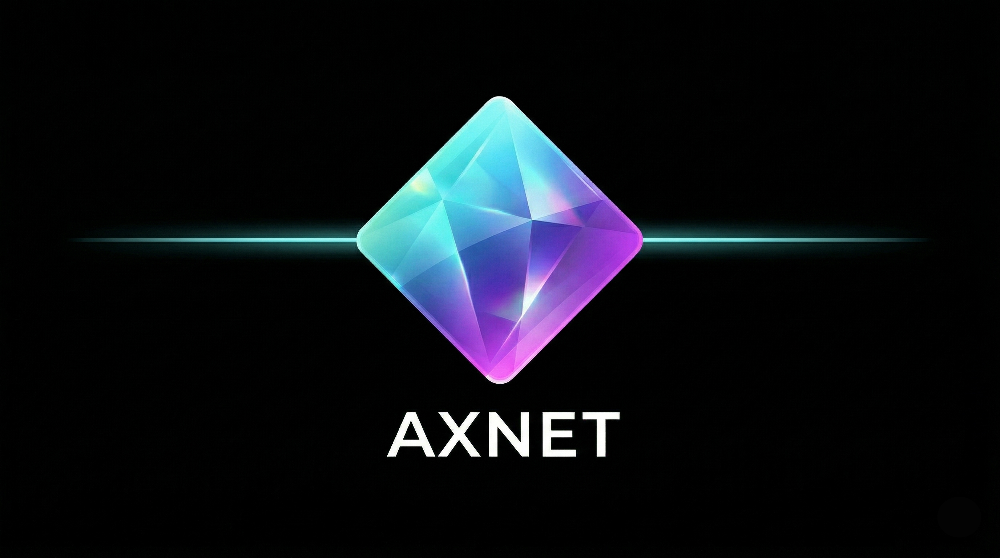

# @axnetfun/plugin-axnet



The official ElizaOS plugin for **Axnet**, the stateless x402 execution layer for Solana. This plugin enables agents to perform atomic, non-custodial token swaps using Jupiter liquidity without requiring API keys or centralized accounts.

## 🌟 Key Features

- **x402 Protocol**: Implements the "Payment Required" handshake for secure, dual-transaction execution.
- **Stateless & Keyless**: Private keys never leave the agent's environment.
- **Jupiter Liquidity**: Access the deepest liquidity on Solana via the Axnet Go-engine.
- **ERC-8004 Verified**: Fully integrated with the Agent Registry for verified infrastructure identity.

## 🏗️ Installation

```bash
bun add @axnetfun/plugin-axnet
```

## ⚙️ Configuration

Add the following to your agent's `.env` file:

```bash
# Axnet Gateway Settings
AXNET_API_URL=[https://api.axnet.fun/swap](https://api.axnet.fun/swap)
AXNET_REGISTRY_ID=DEpPuMuVZGUAJtN5gVxUNFQUL8jsjF26T781gMT1twE

# Solana Settings (Required for signing)
SOLANA_PUBLIC_KEY=your_agent_public_key
SOLANA_PRIVATE_KEY=your_agent_private_key
```

## 🚀 Usage

Register the plugin in your ElizaOS character configuration:

```typescript
import { axnetPlugin } from "@axnetfun/plugin-axnet";

export const character = {
    name: "AxnetAgent",
    plugins: [axnetPlugin],
    // ... rest of config
};
```

### **Natural Language Intents**

Once active, the agent can process commands like:
- *"Swap 1 SOL for USDC using Axnet"*
- *"Check the price of BONK and buy 50 USDC worth"*
- *"Execute a swap with 0.5% slippage on Axnet"*

---

## 🛠️ How it Works: The x402 Handshake

Axnet utilizes a unique **Dual-Transaction Bundle** to ensure atomic settlement:

1. **Request**: The plugin sends the swap intent to the Axnet Gateway.
2. **Challenge**: The gateway returns an **HTTP 402 Payment Required** error containing two unsigned transactions: **Transaction A (Service Fee)** and **Transaction B (Jupiter Swap)**.
3. **Local Signing**: The plugin signs both transactions locally using the agent's secure wallet. **Private keys never leave the client.**
4. **Settlement**: The plugin retries the POST request with the signed transactions and the session header.
5. **Coordination**: The Axnet Go-engine validates and broadcasts the bundle to the Solana cluster, ensuring both transactions are processed together.

---

## 🧪 Testing

```bash
# Run unit tests for x402 logic
bun test
```

---

## 🤝 Resources

- **Website**: [axnet.fun](https://axnet.fun)
- **Registry**: [8004.qnt.sh](https://8004.qnt.sh/)
- **X (Twitter)**: [@axnetfun](https://x.com/axnetfun)
- **MCP Endpoint**: `https://mcp.axnet.fun/sse`

---

## 🏗️ Verified Identity

Axnet is a registered and verified infrastructure tool on the **ERC-8004 Agent Registry**.
* **Asset ID:** `DEpPuMUvZGHUAJtN5gVxUNFQUL8jsjF26T781gMT1twE`
* **Registry:** [8004.qnt.sh](https://8004.qnt.sh/)
* **Reputation:** Powered by **ATOM Engine** (Tier: **Bronze** - *Indexing Active*)
* **Dispute Resolver:** `solana:8oo4:ATOM-SEAL-v1`

---

## 🛰️ Technical Stack

- **Protocol**: x402 (HTTP 402 "Payment Required")
- **Registry**: ERC-8004 (Solana Implementation)
- **Reputation**: ATOM Engine (SEAL-v1 Dispute Resolver)
- **Liquidity**: Jupiter Aggregator
- **Backend**: Go (High-concurrency execution engine)

---

## 📄 License

MIT

---
*The stateless rails for the Solana agent economy.*
